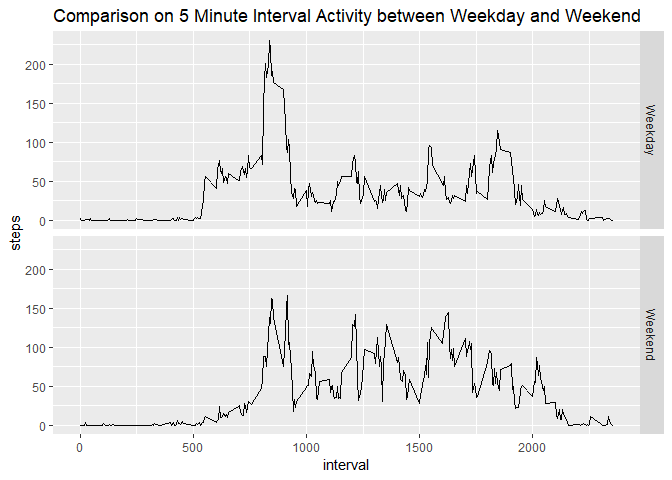

Description
-----------

This is an home work submission to the questions below using the data [Activity Monitor Data](https://d396qusza40orc.cloudfront.net/repdata%2Fdata%2Factivity.zip).

### Loading and prepocessing the data

Read the data using read.csv() and get only the data without **NA** values:

``` r
rawdata<-read.csv("activity.csv", header = TRUE, sep=",")
data<-rawdata[complete.cases(rawdata),]
```

### What is the mean total number of steps taken per day?

1.  Calculate the total number of steps taken per day:

``` r
sumday<-aggregate(data$steps, by = list(data$date), FUN = sum)
names(sumday)<-c("Date", "Total_Step")
head(sumday)
```

    ##         Date Total_Step
    ## 1 2012-10-02        126
    ## 2 2012-10-03      11352
    ## 3 2012-10-04      12116
    ## 4 2012-10-05      13294
    ## 5 2012-10-06      15420
    ## 6 2012-10-07      11015

1.  Make a historgram of the total number of steps taken per day:

``` r
hist(sumday$Total_Step, xlab = "Total Steps", main = "Daily Total Steps Historgram", col = "Pink")
```


1.  The Mean and Median of the total number of steps per day:

``` r
round(mean(sumday$Total_Step),0)
```

    ## [1] 10766

``` r
round(median(sumday$Total_Step), 0)
```

    ## [1] 10765

### What is the average daily acitivty pattern?

1.  Time Series Plot of the Average Step Every 5 Minutes

``` r
aveday<-aggregate(data$steps, by = list(data$interval), FUN = mean)
names(aveday)<-c("Interval", "Average_Step")

# Thisi part is to make the x-axis showing the time representing the interval.
Time<-aveday$Interval
Time2<-mapply(function(x,y)paste0(rep(x,y), collapse = ""), 0, 4-nchar(Time))
Time<-paste0(Time2, Time)
Time<-strptime(Time, format = "%H%M")
Time<-hms::as.hms(Time)
aveday<-cbind(aveday, Time)

plot(strptime(aveday$Time, format = "%H:%M"), aveday$Average_Step, type = "l", xlab = "Time of the Day", ylab = "Average Step", main = "Average Daily Acivity Pattern")
```


1.  The Maximum Number of Steps Accorss All the Days in the Dataset:

``` r
aveday[which.max(aveday$Average_Step),1]
```

    ## [1] 835

### Inputing missing values

1.  Calculate and report the total number of missing values in the dataset:

``` r
sum(is.na(rawdata$steps))
```

    ## [1] 2304

1.  Filling in all of the missing values in the dataset:
2.  Create a new dataset that is equal to the original dataset but with missing data fill in. The dataset is called datafillna.

``` r
library(dplyr)
datafillna<-rawdata %>%
  group_by(interval) %>%
  mutate(steps = replace(steps, is.na(steps), mean(steps, na.rm = TRUE)))

#Verify if datafillna contains any NA value.
sum(is.na(datafillna))
```

    ## [1] 0

``` r
#Display the first few rows of the datafillna.
head(datafillna)
```

    ## # A tibble: 6 x 3
    ## # Groups:   interval [6]
    ##    steps date       interval
    ##    <dbl> <fct>         <int>
    ## 1 1.72   2012-10-01        0
    ## 2 0.340  2012-10-01        5
    ## 3 0.132  2012-10-01       10
    ## 4 0.151  2012-10-01       15
    ## 5 0.0755 2012-10-01       20
    ## 6 2.09   2012-10-01       25

1.  A histogram of the total number of steps taken each day and Calculate and report the mean and median total number of steps taken per day:

``` r
sumdayfull<-datafillna %>%
  group_by(date) %>%
  summarise(steps = sum(steps))
hist(sumdayfull$steps,col = "purple", xlab = "Total Step Per Day", main = "Daily Step per Day with NA Filled")
```


The mean is:

``` r
round(mean(sumdayfull$steps),0)
```

    ## [1] 10766

The difference between the two datasets on mean is:

``` r
mean(sumdayfull$steps)-mean(sumday$Total_Step)
```

    ## [1] 0

The median is:

``` r
median(sumdayfull$steps)
```

    ## [1] 10766.19

The difference between the two datasets on median is as below. The inputing missing data increases the median value.

``` r
median(sumdayfull$steps)-median(sumday$Total_Step)
```

    ## [1] 1.188679

### Are there differences in activity patterns between weekdays and weekends?

1.  Create a new factor variable in the dataset with two levels - "weekday" and "weekend" indicating whether a given date is a weekday or weekend day.

``` r
## Turn the date into date format so the weekdays function can work on the date format. 
datafillna$date<- as.Date(datafillna$date)
## Add a new column to the dataset based on the weekdays. 
datafillna["weekday"] <-weekdays(datafillna$date)
## Categorized the type based on the weekdays. 
datafillna["type"]<-ifelse(datafillna$weekday == "Saturday" | datafillna$weekday =="Sunday", "Weekend", "Weekday")

## Turn the type column into factor
datafillna$type <- as.factor(datafillna$type)
head(datafillna)
```

    ## # A tibble: 6 x 5
    ## # Groups:   interval [6]
    ##    steps date       interval weekday type   
    ##    <dbl> <date>        <int> <chr>   <fct>  
    ## 1 1.72   2012-10-01        0 Monday  Weekday
    ## 2 0.340  2012-10-01        5 Monday  Weekday
    ## 3 0.132  2012-10-01       10 Monday  Weekday
    ## 4 0.151  2012-10-01       15 Monday  Weekday
    ## 5 0.0755 2012-10-01       20 Monday  Weekday
    ## 6 2.09   2012-10-01       25 Monday  Weekday

1.  Make a panel plot containing a time series plot of the 5 minute interval (x-axis) and the average number of steps taken, averaged across all weekday days or weekend days (y-axis).

``` r
weekdaycomp<-datafillna %>%
  group_by(type, interval) %>%
  summarise(steps = mean(steps))
library(ggplot2)
ggplot(data = weekdaycomp, aes(x = interval, y = steps, fill = type)) + facet_grid(type ~ . ) + geom_line()+ ggtitle ("Comparison on 5 Minute Interval Activity between Weekday and Weekend")
```



On weekdays, there are more steps in the early of the day and less during the rest of the day. On weekends,comparing to the weekdays, there are less steps in the morning, but the number of steps are generally higher than the ones at the same time during rest of the day. It appears that during weekends, the testers start the day later than they do on the weekdays, and they are more active later on. It may be because on the weekdays early morning, the testers have to go to work early; while on the weekend, the testers start the day later. And, they have more chance to move around during the day; while on the weekdays they have to sit down and work.
